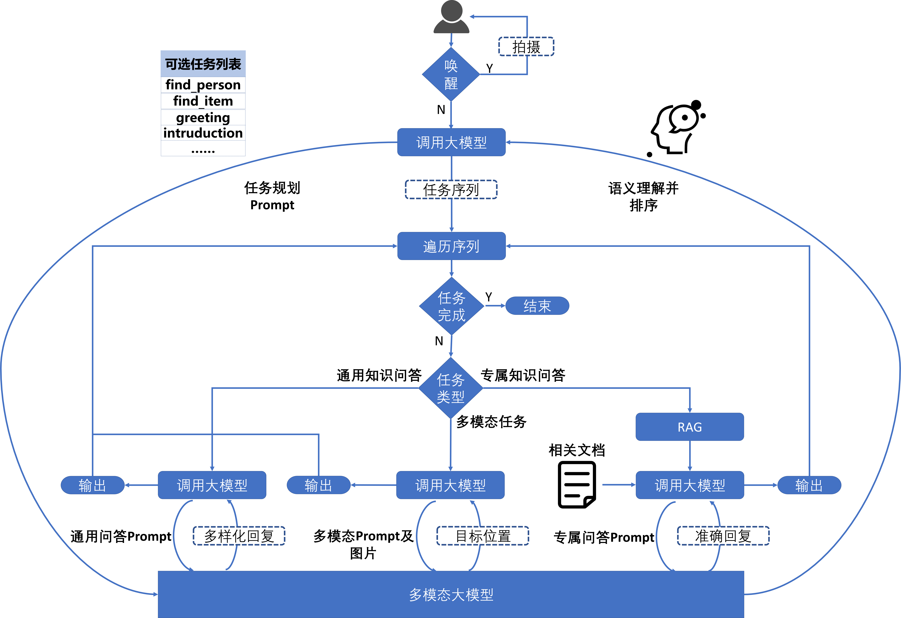

# 智能服务机器人

> 基于多模态大模型的任务规划与自主执行系统 —— 让机器人真正“听懂指令、看懂环境、完成复杂任务”

---

## 📌 项目背景

传统服务机器人通常依赖预设规则或单一模态输入（如语音或文本），难以应对开放场景下的复杂用户指令，例如：“帮我把茶几上那本红色封面的书拿过来”。这类命令涉及**自然语言理解、图像识别、目标定位与路径规划**等多个环节，对系统的综合智能水平提出了极高要求。

为此，本项目构建了一套 **基于多模态大模型的智能服务机器人系统**，利用提示词工程驱动大模型进行**高层任务规划**，将用户指令分解为可执行的细粒度子任务，并调度不同功能模块协同完成操作。系统实现了从“被动响应”到“主动理解+自主决策”的跃迁，显著提升了在真实场景中的服务能力与用户体验。

---

## 🧩 项目内容

本系统以“感知 → 理解 → 规划 → 执行”为主线，实现以下核心功能：

1. **多模态输入融合**
   - 支持语音/文本指令 + 实时摄像头图像输入
   - 图像与语言信息同步送入多模态模型进行联合理解

2. **大模型驱动的任务规划**
   - 利用提示词工程引导大模型将模糊指令拆解为有序任务流：
     ```
     用户指令：“走到黑色衣服客人面前问好”
     ↓
     任务序列：
     1. 定位人群位置（声源定位）
     2. 识别出目标人物位置（多模态大模型）
     3. 走到客人面前（机器人控制）
     5. 执行问好行为（语音）
     ```

3. **模块化任务分发与执行**
   - 根据任务类型自动路由至对应模块：
     - 视觉模块：目标检测与空间定位
     - 大模型模块：意图识别和目标人物定位
     - 规划模块：任务分解＋任务路由
   - 各模块完成后反馈状态，支持异常回退与重试

4. **上下文记忆与动态 Prompt 优化**
   - 记录历史交互与环境变化，增强多轮对话连贯性
   - 动态调整 Prompt 模板，提升任务分解准确性

---

## 🏗️ 项目框架

### 技术栈

| 类别             | 技术选型 |
|------------------|----------|
| 多模态理解       | OpenAI CLIP / LLaVA / Qwen-VL（Hugging Face Transformers） |
| 模型微调         | LLaMA-Factory + SFT（监督微调） |
| 提示工程         | 动态 Prompt 工程 + Chain-of-Thought 设计 |
| 任务编排         | 自研任务规划引擎  |
| 视觉定位         | YOLOv8 + 相机标定 + 坐标映射（像素→世界坐标） |
| 开发语言         | Python |
| 运行环境         | Linux（Ubuntu 20.04+），ROS（可选集成） |
| API 通信         | gRPC / RESTful 接口 |

### 系统架构图（文字描述）

